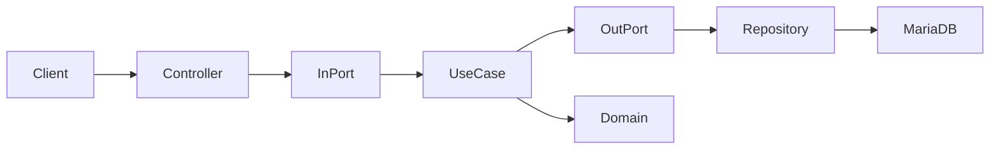
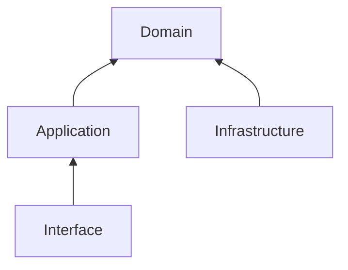
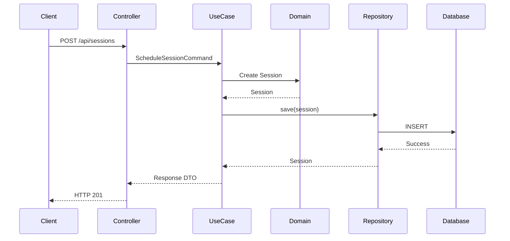
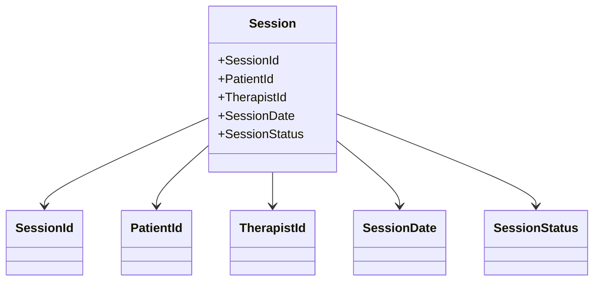
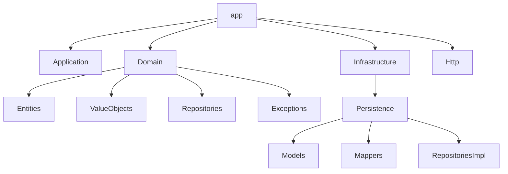

Architecture.md

# Architecture

## Overview

The project follows Domain-Driven Design (DDD) combined with Hexagonal Architecture and Clean Architecture principles.

The primary objective is to separate business logic from framework-specific code, allowing the domain to evolve independently from Laravel and any infrastructure concerns.

Laravel is considered an implementation detail responsible for exposing HTTP endpoints, managing dependency injection and interacting with external systems.

---

# Architectural Principles

The architecture is based on the following principles:

* Business logic belongs to the Domain layer.
* Application use cases orchestrate business operations.
* Infrastructure contains framework-specific implementations.
* Dependencies always point toward the Domain.
* The Domain must not depend on Laravel.

---

# Layered Architecture

Each layer has a single, well-defined responsibility.

---

# Hexagonal Architecture

The application uses Ports and Adapters to isolate the core business logic.

Input Ports define the operations exposed by the application.

Output Ports define the dependencies required by the application.

Adapters translate framework-specific implementations into those abstractions.

---

# Domain Layer

The Domain layer contains the business model.

It represents the language of the business and contains all business rules.

This layer must remain completely independent from Laravel.

Typical components include:

* Entities
* Value Objects
* Repository Interfaces
* Domain Exceptions
* Domain Services (when necessary)

The Domain must never know:

* HTTP
* Controllers
* Requests
* Responses
* Database engines
* Eloquent
* Dependency Injection
* Framework utilities

---

# Application Layer

The Application layer coordinates business operations.

It does not contain business rules.

Instead, it orchestrates the execution of domain objects.

Typical responsibilities include:

* Use Cases
* DTOs
* Application Services
* Coordination between repositories and domain objects

Each use case should represent one business action.

Examples:

* CreateSession
* CancelSession
* CompleteSession

---

# Infrastructure Layer

The Infrastructure layer contains all technical implementations.

Typical responsibilities include:

* Eloquent models
* Repository implementations
* Database access
* External APIs
* Docker configuration
* Persistence

The Infrastructure layer depends on the Domain, never the opposite.

---

# Interface Layer

The Interface layer exposes the application to the outside world.

In this project, it is responsible for the HTTP API.

Typical components include:

* Controllers
* API Resources
* Requests
* Route definitions

Controllers should remain as thin as possible.

Their responsibility is limited to:

* Receiving the request.
* Invoking the appropriate use case.
* Returning the HTTP response.

Business decisions should never be implemented inside controllers.

---

# Dependency Rule

Dependencies always point toward the Domain.

The Domain never depends on any outer layer.

---

# Data Flow

The expected execution flow is:

Responses follow the reverse path.

---

# Repository Pattern

Repository interfaces belong to the Domain.

Repository implementations belong to the Infrastructure layer.

This allows the business model to remain independent from the persistence technology.

The Domain should never know whether data is stored in:

* MariaDB
* PostgreSQL
* Redis
* External APIs
* Files

Only the Infrastructure layer is aware of those details.

---

# Entities

Entities represent business concepts with identity.

In this project, the primary entity is:

* Session

Entities encapsulate business rules and protect their own invariants.

---

# Domain Diagram

---

# Value Objects

Value Objects represent immutable concepts without identity.

Examples include:

* SessionId
* PatientId
* TherapistId
* SessionStatus
* SessionDate

Whenever possible, primitive values should be replaced by Value Objects to improve readability and expressiveness.

---

# Use Cases

Each use case represents a single business action.

A use case should:

* Perform one operation.
* Coordinate domain objects.
* Remain independent from HTTP.
* Return only the information required by the caller.

---

# Error Handling

Business rule violations should be represented as Domain Exceptions.

Infrastructure failures should remain inside the Infrastructure layer whenever possible.

The HTTP layer is responsible for translating exceptions into appropriate HTTP responses.

---

# Persistence

Persistence is considered an implementation detail.

Business logic must never depend on Eloquent models.

Repository implementations are responsible for translating between Domain Entities and persistence models.

---

# Testing Strategy

The architecture has been designed to facilitate automated testing.

The Domain should be testable without:

* Laravel
* MariaDB
* Docker
* HTTP

Framework integration will be validated separately through Feature Tests.

---

# Future Evolution

The architecture has been intentionally designed to support future extensions, including:

* Domain Events
* Strategy Pattern
* Specification Pattern
* Observer Pattern
* External API integrations
* Authentication
* Authorization

These additions should require minimal changes to the existing Domain layer.

---

# Architectural Goal

The primary goal of this architecture is not complexity.

It is clarity.

Every class should have a well-defined responsibility.

Every dependency should have a clear direction.

Every business rule should live inside the Domain.

Laravel should remain a tool that supports the architecture, never the architecture itself.
